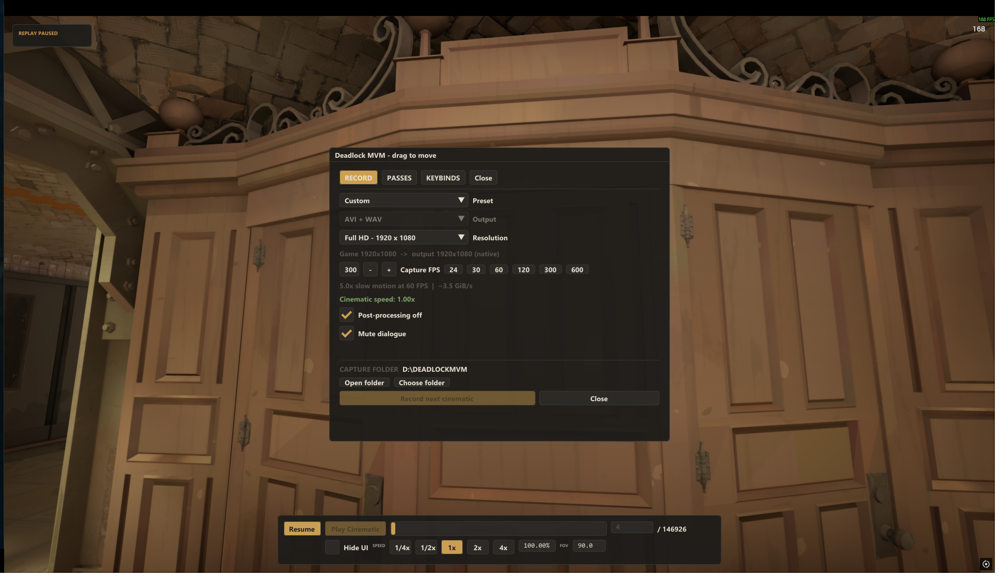
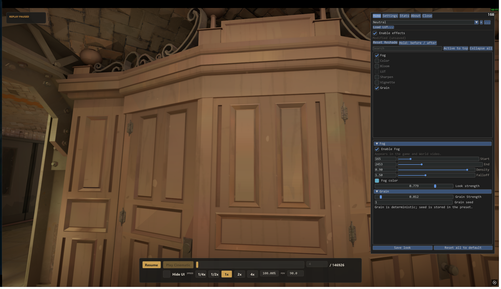
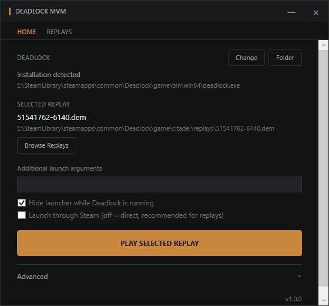

# Deadlock MVM

 

A cinematic camera and movie-making tool for local Deadlock replays.

## Get started

[Download for Windows](https://github.com/tbhtho/deadlock-mvm/releases/download/final/DeadlockMVM-Windows-x64.zip), extract the ZIP, and run `DeadlockMVM.Launcher.exe`. Select a local `.dem` replay.

Requires **Windows x64**, **Direct3D 11**, and **`-insecure`**. The download includes .NET.

**Project lifespan: 2026-08-21 → 2026-09-16.**

   
  Recording menu in an earlier replay build, September 9, 2026.

<table><tr>
  <td width="65%"> Effects panel, September 9, 2026.</td>
  <td width="35%"> Launcher from the earlier October 7 source check.</td>
</tr></table>

These older captures do not establish compatibility with the current game update.

## Features

- Free camera with position, rotation, roll, FOV, movement speed, sensitivity, and smoothing controls.
- Camera paths with keyframes, linear or smooth interpolation, editing, and saved paths.
- Replay browsing, playback, pause, speed, and tick controls.
- Configurable keyboard and mouse bindings, a movable menu, and a separate effects panel.
- Built-in Fog, Color, Bloom, LUT, Sharpen, Vignette, Grain, and depth of field controls.
- Movie capture: World, Z-Depth, and Green Screen passes, TGA/PFM sequences, AVI output, and H.264 preview MP4s.

Audio and Green Screen remain unreliable. The tested game build rejected an older replay and failed native hook checks; playback and reported 4 GB game-memory use remain unresolved. These are built-in effects; external ReShade and arbitrary `.fx` shaders are unsupported.

## Controls

**Tab** opens the menu. **CapsLock** opens effects. **F9** restores the game UI and input. Change bindings in **Advanced > Open keyboard + mouse**. [Full controls](CONTROLS.md).

[Third-party notices](THIRD_PARTY_NOTICES.md)

## License

Licensed under [MIT](LICENSE). Dear ImGui and libgmavi retain their [own licenses](THIRD_PARTY_NOTICES.md). Not affiliated with Valve.
